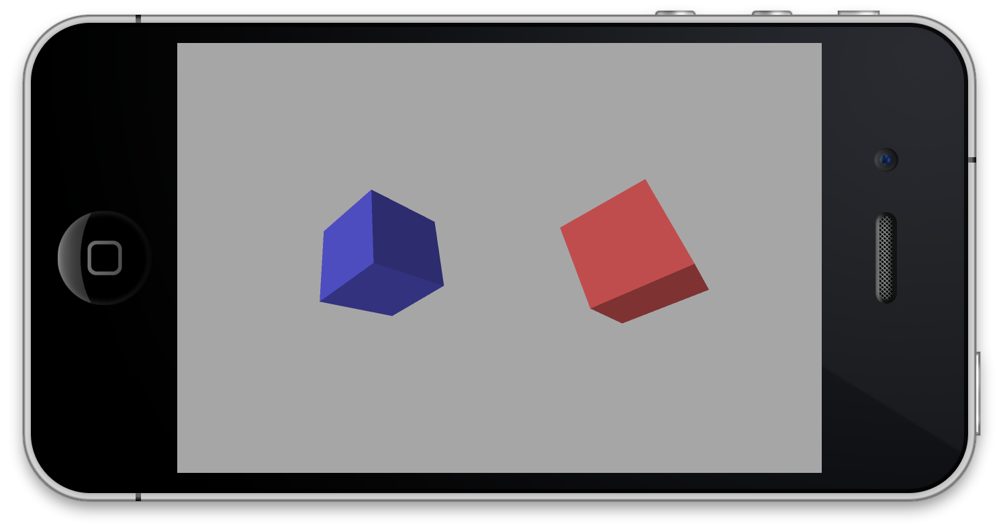
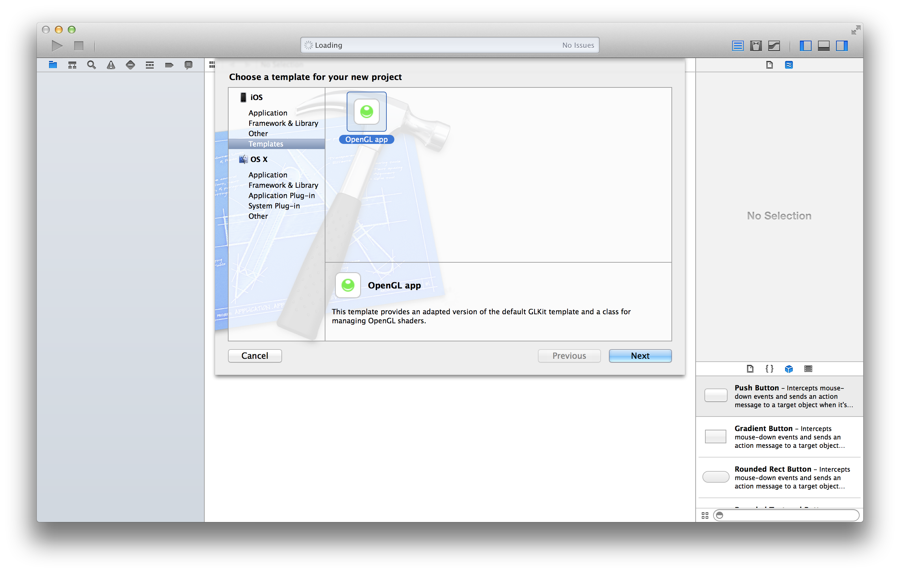

#OpenGLTemplate

The default OpenGL template for iOS demonstrates how to use GLKit's effect class and how to use raw OpenGL shaders. Unfortunately a lot of the code doesn't follow recommended practices by Apple, and I often find myself deleting most of it and including my own shader class.

I've therefore created an adapted version of the template with a few extras and adaptations:

* No use of GLKit effects - everything is done with raw OpenGL shaders, which tends to be faster
* Shaders use per-fragment diffuse lighting (N.B. this isn't better than doing per-fragment diffuse lighting, but puts you in a better position to adapt it for specular lighting)
* `@import` rather than `#import`
* A `GLProgram` class that I use on my projects. This class simplifies the compilation of OpenGL shaders and makes it easy to access the indicies of attributes and uniforms
* Model data is in structs in a separate header file
* `BUFFER_OFFSET_` macro isn't used - `offsetof` is instead
* Default is at 60fps and 4x anti-aliasing with depth testing and blending enabled
* Status bar is hidden by default

Overall, however, it looks exactly the same:

##Installation

It is really easy to get started:

* Download a copy of this repository
* Copy OpenGL app.xctemplate into `~/Library/Developer/Xcode/Templates` (you may need to create this directory)
* The template is added to a new 'Templates' group when you create the project:
  
  